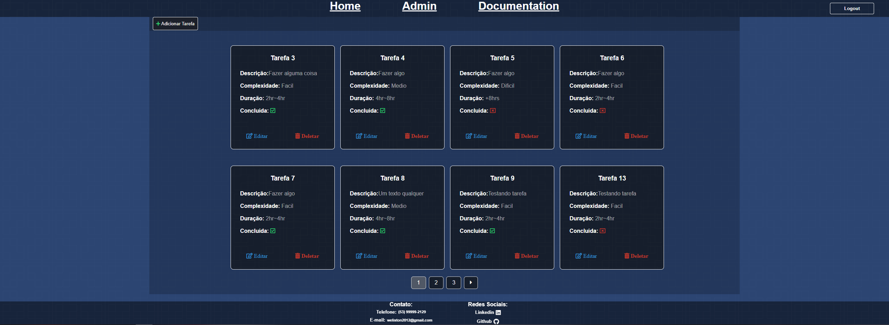
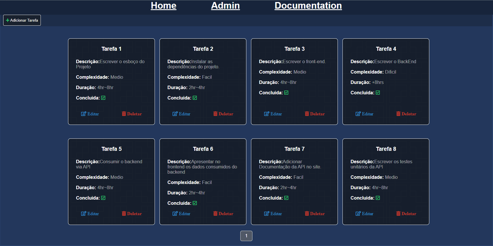
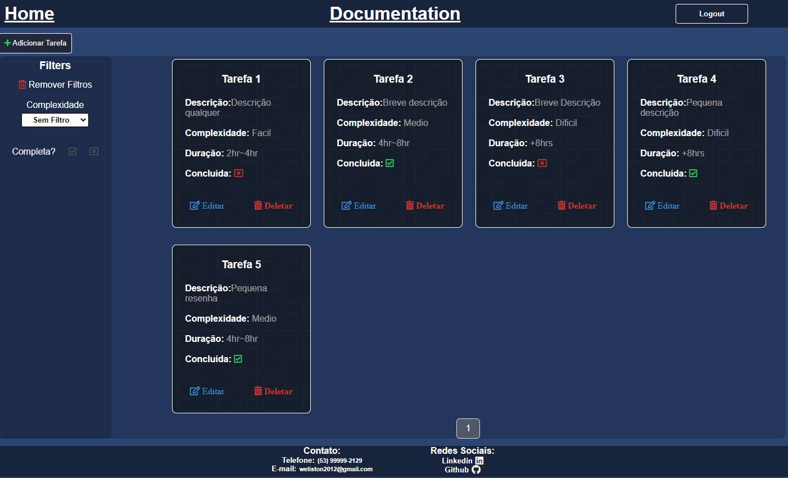
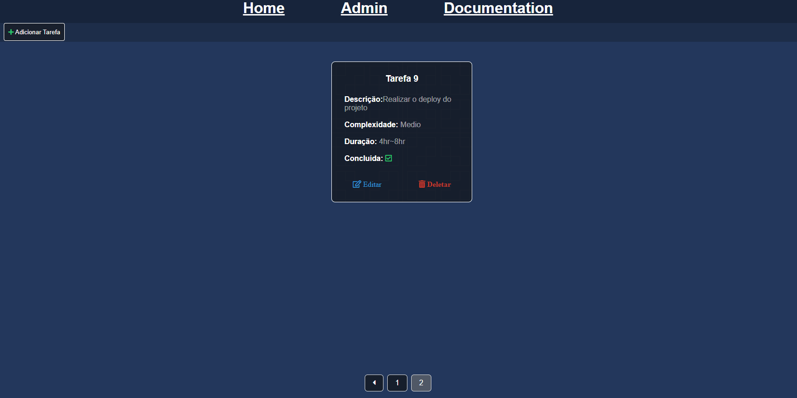

# README

<p align="center">
    <a href="#sobre">Sobre</a>
    <a href="#tecnologias">Tecnologias</a>
    <a href="#funcionalidades">Funcionalidades</a>
    <a href="#demonstracao">Demonstração</a>
    <a href="#instalacao">Instalação</a>
</p>

# Sobre
<p>Este projeto foi construído com o intuito de praticar o uso do Django Rest Framework para construção de API's REST seguindo o padrão REST Full. Bem como consumi-las no Front-End.<br>
Consiste em uma lista de tarefas que podem ou não estarem finalizadas. Este projeto conta com um CRUD completo, além da utilização de <strong>signals</strong> no back-end juntamente com <strong>paginação</strong> e a realização de testes unitários da API .</p>

# Tecnologias
<p>O projeto foi construído utilizando as seguintes tecnologias:</p>
<ul>
    <li>Python</li>
    <li>Django</li>
    <li>Django Rest Framework</li>
    <li>JavaScript</li>
    <li>HTML5</li>
    <li>CSS</li>
    <li>MySQL</li>
</ul>

# Funcionalidades
- [x] Criar uma conta.
- [x] Realizar login.
- [x] Adicionar uma nova tarefa.
- [x] Editar uma tarefa.
- [x] Deletar uma tarefa.
- [x] Listar as tarefas.
- [x] Filtrar as tarefas.
- [x] Paginação.
- [x] Responsividade.
- [x] Utilização de Signals ao registrar/editar uma tarefa.
- [x] Authorização para consumo da API via Token.
- [x] Testes unitários da API.

# Demonstracao
Link para a [aplicação](https://listadetarefas-django.herokuapp.com/)
<h1 align="center">
    Listagem das tarefas com o método GET
    
    Adição de novas tarefas com o método POST
    
    Edição das tarefas com o método PUT
    
    Exclusão das tarefas com o método DELETE
    
</h1>


# Instalacao
Antes de começar, você vai precisar ter instalado em sua máquina as seguintes ferramentas:
[Git](https://gitscm.com), [Python](https://www.python.org/downloads/) e um servidor MySQL, recomendo o [MySQLWorkbench](https://dev.mysql.com/downloads/workbench/).
Além disso é bom ter um editor para trabalhar com o código como o [VSCode](https://code.visualstudio.com/download) ou o [PyCharm](https://www.jetbrains.com/pt-br/pycharm/download/) (Recomendado).

```bash
# Clone este repositório
$ git clone <https://github.com/welistonbelles/djangoListaDeTarefas>

# Acesse a pasta do projeto no terminal/cmd
$ cd djangoListaDeTarefas

# Instale as dependências
$ pip install -r requirements.txt
```
### 🔧 Configuracao
```python
# Conecte o arquivo lista_de_tarefas.sql com o seu banco de dados MySQL.

# Abra o arquivo listatarefas/settings.py e nesta parte configure de acordo com seu banco de dados
DATABASES = {
    'default': {
        'ENGINE': 'django.db.backends.mysql',
        'NAME': 'lista_de_tarefas',
        'USER': 'root',
        'PASSWORD': '',
        'HOST': 'localhost',
        'PORT': '3306',
    }
}

# Após conectar com seu banco de dados, é hora de rodarmos as migrates.

# Crie as migrations
python manage.py makemigrations

# Aplique elas ao seu banco de dados
python manage.py migrate

# Com tudo configurado, basta rodarmos nossa aplicação:
python manage.py runserver
```